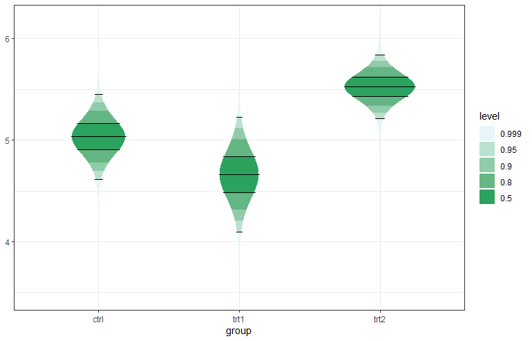

ggstudent - Continuous Confidence Interval Plots using t-Distribution
============================================

The R package ggstudent provides an extension to `ggplot2` for creating two types of continuous confidence interval plots, typically for the sample mean. These plots contain multiple user-defined confidence areas with varying colours, defined by the underlying t-distribution used to compute standard confidence intervals for the mean of the normal distribution when the variance is unknown.

Two types of plots are available, a gradient plot with rectangular areas, and a violin plot where the shape (horizontal width) is defined by the probability density function of the t-distribution.

See also the [related paper](https://arxiv.org/pdf/2002.07671) and [repository](https://github.com/helske/statvis)

Here is an example:
```r
library("magrittr")
library("dplyr")
library("ggplot2")
library("scales")

ci_levels <- c(0.999, 0.95, 0.9, 0.8, 0.5)
n <- length(ci_levels)
ci_levels <- factor(ci_levels, levels = ci_levels)
PlantGrowth %>% dplyr::group_by(group) %>%
  dplyr::summarise(
    mean = mean(weight),
    df = dplyr::n() - 1,
    se = sd(weight)/sqrt(df + 1)) %>%
 dplyr::full_join(
   data.frame(group =
     rep(levels(PlantGrowth$group), each = n),
     level = ci_levels), by = "group") -> d

p <- ggplot(data = d, aes(group)) +
 geom_student(aes(mean = mean, se = se, df = df,
   level = level, fill = level), draw_lines = c(0.95, 0.5))

g <- scales::seq_gradient_pal("#e5f5f9", "#2ca25f")
p + scale_fill_manual(values = g(seq(0, 1, length = n))) + theme_bw()
```


See also the R package [ggnormalviolin](https://github.com/wjschne/ggnormalviolin) for creating violin plots based on normal distribution.
